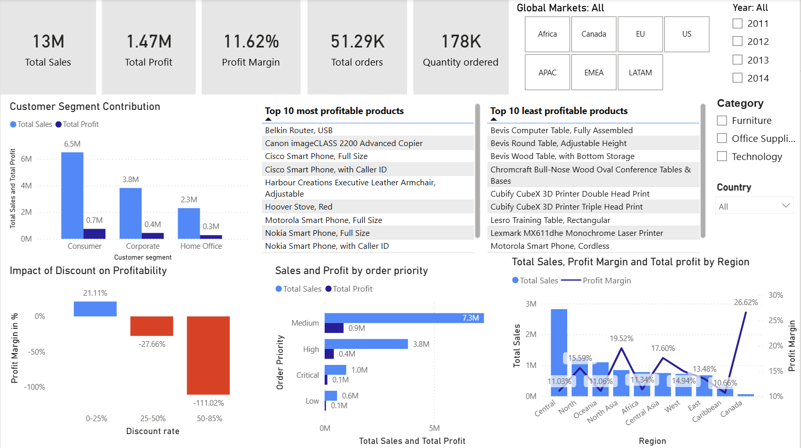

# Superstore_sales_and_profit_analysis
Sales, profit and profitability analysis using Python, MySQL and Power BI

## Overview
This project analyzes sales and profitability data to identify key business drivers affecting sales, profits, profit margins, and overall business performance. It is focuses on product performance, category performance, discount impact, Shipping mode, regional trends and customer segments.

## Dataset
- Source: Kaggle - [Superstore Sales dataset](https://www.kaggle.com/datasets/aditisaxena20/superstore-sales-dataset)
- Records: ~51,300 rows
- Features: Sales, Profit, Discount, Category, Subcategory, Region, Segment, Order Date, Shipping mode etc.

## Tools used
- Python (Pandas, Matplotlib)
- MySQL
- Power BI

## Key Analysis Performed
- Data cleaning and preprocessing (handling mixed date formats, missing values, handling numeric columns stored as texts)
- Sales, profit, and profit margin analysis
- Category and sub-category performance evaluation
- Regional and market-level profitability analysis
- Shipping mode, Order priority and yearly performance analysis
- Discount rate segmentation and its impact on profit
- Product-level analysis (top/bottom performers)
- Unit economics (profit per unit)

## Key Insights
- High discounts (>25%) lead to significant losses, negatively impacting profitability.
- High sales do not necessarily mean profitability. For example, Tables generate significant amount of sales, but are loss-making, highlighting potential inefficiencies in pricing or discount strategies.
- Large variation exists in product profitability, with some items generating high profits per unit while others incur heavy losses.
- Regional performance varies significantly, indicating differences in market efficiency.
- Profitability varies significantly within the same market, indicating that regional-level strategies are required rather than a one-size-fits-all approach.

## Power BI Dashboard
- Use slicers to filter by category, region, and year. Multiselect is also possible.
- Explore product-level performance using top/bottom product tables

